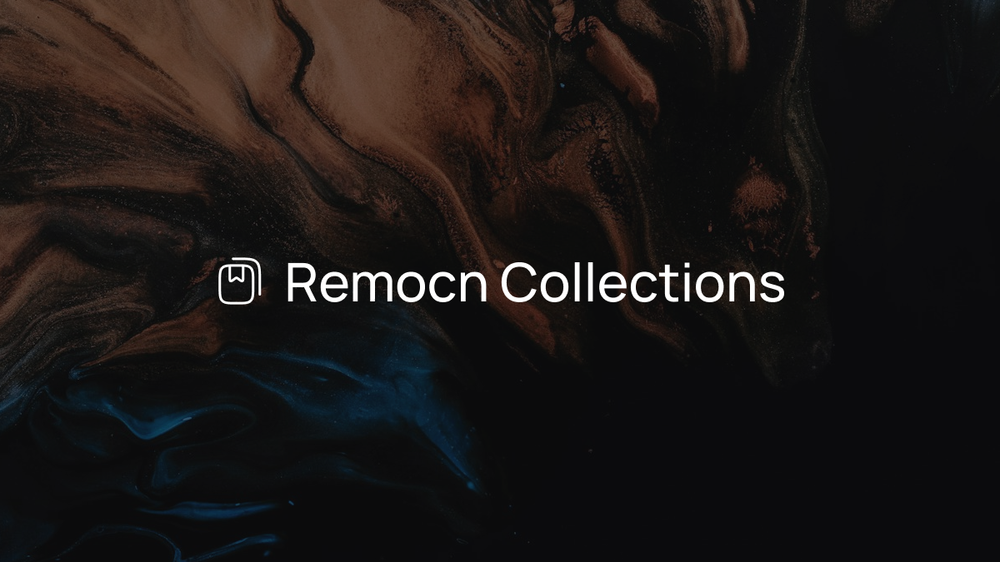

# Remocn Collections

A gallery of motion design videos created by AI agents. Every video in this
collection started as a single prompt — a coding agent read it, invented the
story, and built the whole picture: the typography, the color, the rhythm,
the transitions, and the final cut.

**Watch the gallery:** [collections.remocn.dev](https://collections.remocn.dev)

## The goal

This project exists to answer one question: can an AI agent produce real,
branded motion design — not a template with swapped-in text, but a finished
video with its own visual language?

Each demo is an experiment in that direction. Product intros, sponsor
announcements, and release videos that would normally take a motion designer
days are generated from a prompt, and the result is published as-is —
together with the exact prompt that produced it, so you can see what was
asked and what came back.

It also serves as the public example library for
[remocn](https://remocn.dev), a collection of ready-made video components:
every demo can be taken apart, reused, and installed into your own project
as a starting point.

## What's inside

Twenty videos so far, each with its own brand and register:

- **Product introductions** — launch spots for remocn itself, a gift cut
  introducing shadcn/ui made for shadcn, and intros for shieldcn, Tegami,
  Fonttrio, render-sdk, and batchwork.
- **Sponsor announcements** — collab lockups for OrcDev, react-bits,
  shieldcn, and LN, each rendered in the sponsor's own visual world: 8-bit
  pixel snaps, violet dither, badge green, floating emoji.
- **Changelogs** — release videos where the new features present
  themselves: eleven scene transitions demonstrated by the video's own cuts,
  chat components playing live inside phone frames, rolling numbers, and the
  story of the rebuilt agent skill.
- **Showcases and experiments** — typography animations introducing their
  own names, GPU shaders open-sourced by Paper, an animated signup flow, and
  a meta spot where Claude Code makes the video about making videos.

Every demo page in the gallery shows the same four things side by side: the
video, the prompt it was generated from, the source code, and a one-line way
to bring the demo into your own project.

---

Built with [remocn](https://remocn.dev) — cinematic video components for React.
